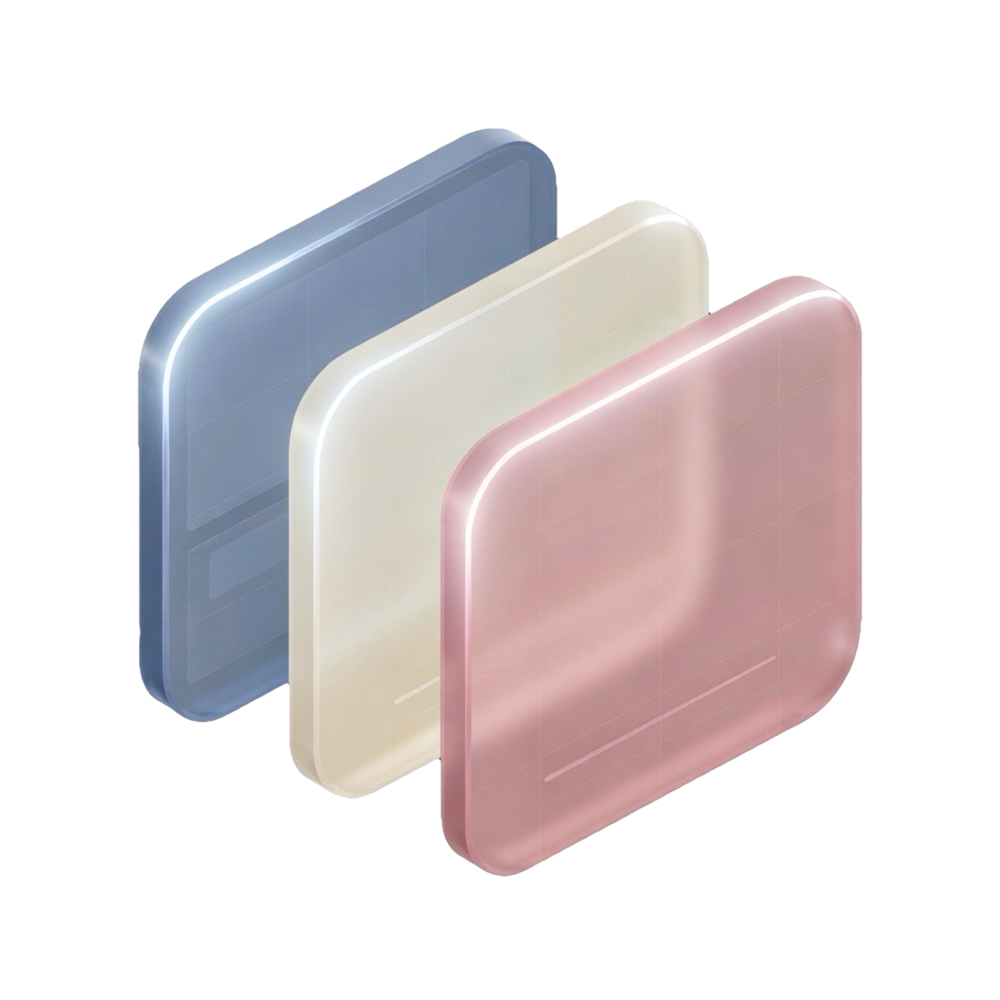

<p align="center">
  
</p>

# Glim

[](https://github.com/lykhonis/glim/actions/workflows/ci.yml)
[](LICENSE)

A **C++ compositor** for user interfaces: rectangles, groups, opacity, a little perspective. **2D with slight 3D.** Not a game engine. Not a widget kit.

You record paint. Compatible groups **merge into one pass**. An offscreen exists only when opacity or a tilt needs it. **Metal, Vulkan, or WebGPU** when the device has a GPU; the same `draw` rasters **CPU** when it does not.

Glim sits in a shell you already have — a TV launcher, a vehicle HMI, a phone, a browser, a desktop.

- **In-process:** `draw` the scene. No packet, no extra copy.
- **Embedded:** a sandboxed guest (WASM, out-of-process UI) `encode`s one frame packet per vsync; a native host `submit`s it. The OEM keeps the swapchain and the run loop.

## Try it

```sh
pnpm install
pnpm test
pnpm exec nx run hello:run
```

---

[MIT](LICENSE) · [Volodymyr Lykhonis](https://lykhonis.com)
